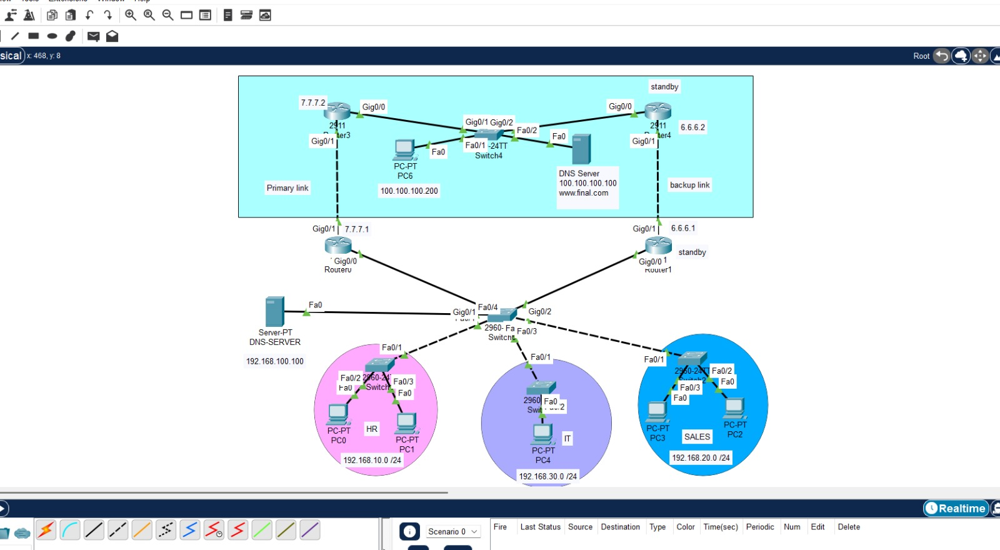
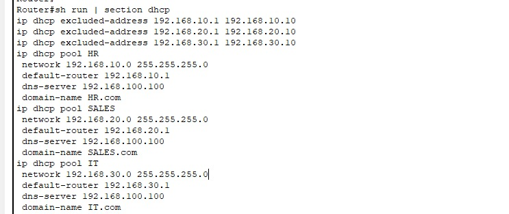
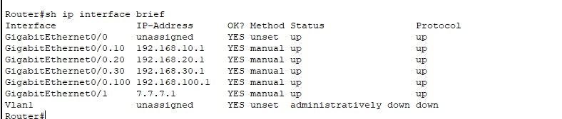
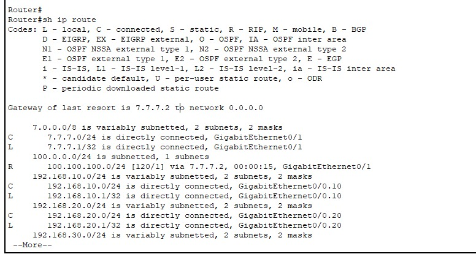
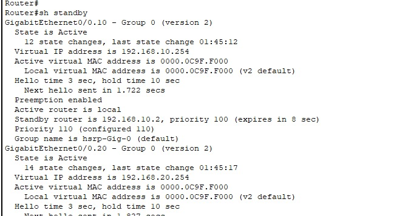

# small-enterprise-network

Completed a Network Engineering Lab Project

I designed and configured a small enterprise network including:

* Routing using RIP v2
* Gateway redundancy using HSRP (Active / Standby routers)
* VLAN segmentation using switches
* Inter-VLAN routing
* PAT (Port Address Translation) for internet access
* DHCP for automatic IP address assignment
* Network testing and troubleshooting

In this lab, if the active router fails, the standby router automatically takes over using the virtual IP to maintain network connectivity.

Technologies used:
Cisco Routers & Switches
RIP v2
HSRP
VLANs
PAT (NAT Overload)
DHCP
Packet Tracer

This project helped me practice routing protocols, network services, redundancy, and real-world network troubleshooting.

